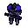
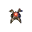
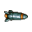
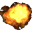
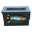
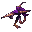
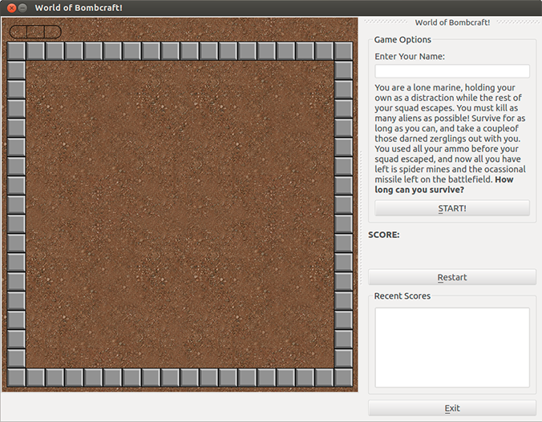

### Game Design Document

#World of BombCraft

### Matthew Pohlmann

You are a _lone marine_, holding your own as a distraction while the rest of your squad escapes. You must kill as many aliens as possible! _Survive_ for as long as you can, and take a couple
of those darned zerglings out with you. You used all your ammo before your squad escaped, and now all you have left is _spider mines_ and the ocassional _missile_ left on the battlefield.

**How long can you survive?**

----

## Gameplay
World of BombCraft is a bomberman-like game; you control a single unit with WASD controls and can place mines used to destroy enemy aliens. The difference here is that the aliens cannot
drop mines; instead, they will move randomly around the game world and you must use strategic bomb placement and missile pickups to kill them. Survive for as long as possible to rack up a high score.
Running into an alien causes you to lose one of your three lives (the alien will also be destroyed). If you lose all three lives, the game is over. Health drops will appear on the field, and picking
one up will increase your lives by one. Score increases for the number of aliens you can kill. The game will be divided into a grid, and movement will be based on this grid. (Units essentially snap
to the grid). When the player presses start, the grid (terrain) is randomly filled in with indestructible and destructible walls.

----

## In-Game Objects ("Things")

#### Indestructible Walls

These walls block player and enemy movement.

#### Destructible Walls

These walls block player and enemy movement; however, a player's mines or missiles can destroy them, opening new paths.

#### Space Marine (The Player)

This is the player, controlled by the arrow keys. He can drop mines and shoot missiles when he has them. He can move freely in the game's grid where there are no walls.

#### Mine

This is the spider mine that the player can drop to kill aliens. The explosion cannot go over walls, but can destroy _Destructible Walls_; the explosion will extend 4 grid spaces. Aliens and the player 
can walk over the mine freely.

#### Missile

This is the missile that the player can fire. It can fly over walls to hit aliens to a maximum of 5 grid spaces, but does not collide with aliens beforehand. Its explosion can extend beyond walls, break _Destructible Walls_, and will extend 2 grid spaces. These will be rare, 
and can only be gotten by picking up the _Missile Powerup_. The player starts with one missile, and can only ever have 3 max.

#### Explosion

This is the explosion that spawns after a missile or mine explodes. It destroys powerups, aliens, and destructible walls. If it hits the player, the player loses a life. It is animated in-game.

#### Missile Powerup

This is the powerup that gives the player a missile. It moves randomly around the map without regard to aliens or the player, but cannot go through walls. There can only ever be three missile powerups
in the game at a time.

#### Health Powerup

This is the powerup that gives the player another life. It teleports randomly around the map to locations without players, enemies, walls, or other powerups. There can only ever be two health powerups
in the game at a time.

#### Alien

This is the game's main enemy. Aliens simply move randomly around the game's grid. If a player runs into an enemy he loses a life, destroying the enemy in the process.

----

## Game Specifics

### User Interface

 + **START!** Button: Starts the game. After the game starts, it becomes the **Pause** and **Resume** button
 + **Restart** Button: Clears the game screen and saves the current player's score
 + **Exit** Button: Exits the application
 + _QLineEdit_ for entering name. Constrained to only 20 characters long
 + _Score_ display for displaying the current score
 + _Lives_ display in the upper left hand corner of the game window
 + _Missiles_ display in the upper left hand corner of the game window next to the lives display
 + File menu containing the same functions as the buttons
 

### Controls
**Keyboard:**

| Key           | Effect                                                  |
| ------------- | ------------------------------------------------------- |
| 'A' Key       | Left player movement by one grid space                  |
| 'D' Key       | Right player movement by one grid space                 |
| 'W' Key       | Up player movement by one grid space                    |
| 'S' Key       | Down player movement by one grid space                  |
| Space Bar     | Place a mine at the player's location                   |
| Shift Key     | Fires a missile in the direction the player is looking  |

**Mouse:**
None planned, other than navigating menus and the rest of the application.

### Score Keeping
  + _Aliens_ give 50 points for each alien killed (not counting when an alien hits a player, causing life damage)
  
### Player Lives
The player will immediately lose a life if he collides with an alien, destroying the alien in the process. The player starts with 3 lives, and when lives reaches 0 the game ends. More lives can be found
on the battlefield throughout the game. Whenever a player takes life damage, he becomes invulnerable for a short time.

### Things to Add
  + Improved UI
  + Saved High Score list between sessions
  + Game Over screen/indication
  + Missiles should collide with aliens en-route (not only after 5 grid spaces). This currently is not implemented because of the fact that fast-moving missiles sometimes do not detect collisions.
